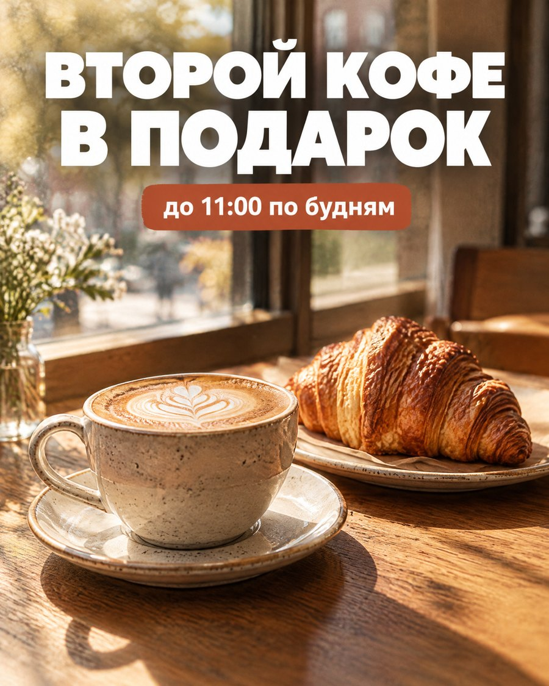
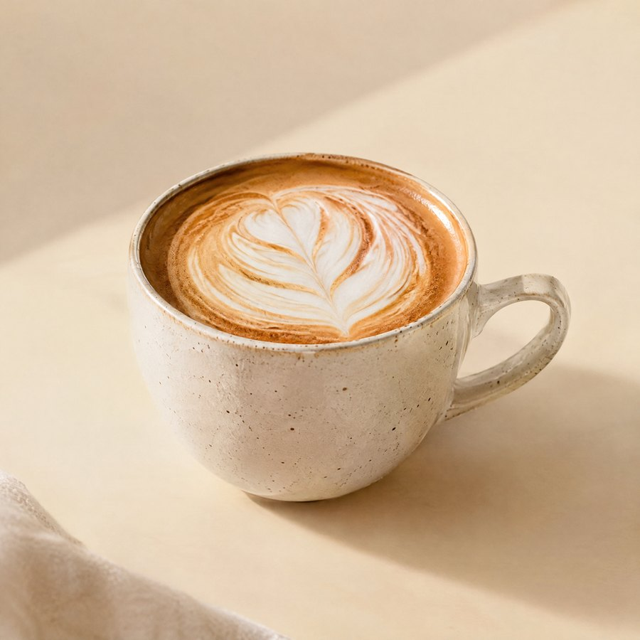
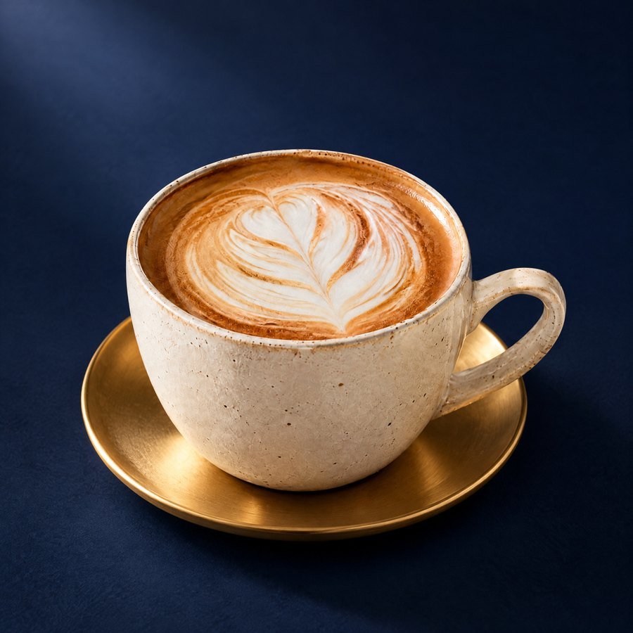
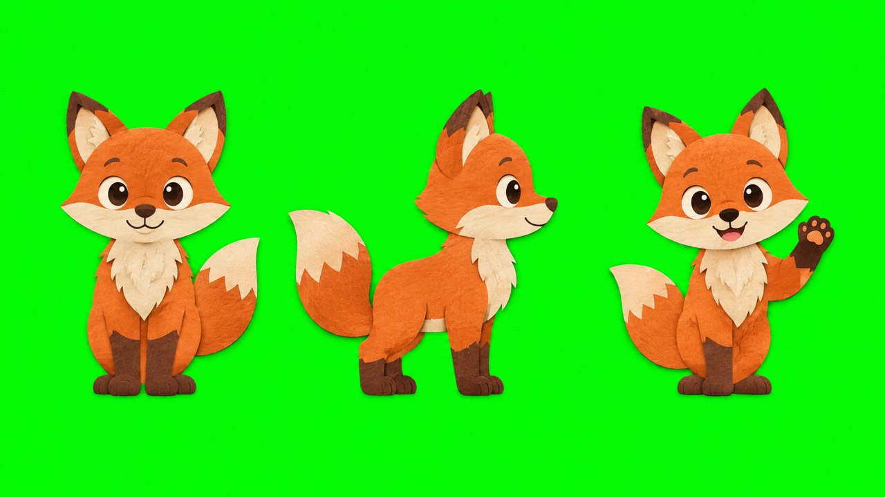

# image-gen — картинки для агента через GPT Image 2.5

**Скилл для Claude Code, Codex и других агентов:** генерация и правка изображений через [laozhang.ai](https://laozhang.ai)
(GPT Image 2.5, $0.03 за картинку). Точный кириллический текст на макетах, правка по референсам, пакеты до 4 потоков,
автосжатие, постоянный архив и личный журнал промптов. Плюс апскейл, видео из картинки (Seedance 2.0) и видеопетли для сайтов.

<table>
<tr>
<td width="50%"><br><sub>Баннер 4:5: текст на кириллице дословно из промпта</sub></td>
<td width="50%"><br><sub>Предметное фото 1:1 из одной фразы</sub><br><br><br><sub>Правка той же картинки через <code>--ref</code>: новый фон и блюдце</sub></td>
</tr>
<tr>
<td colspan="2"><br><sub>Лист персонажа на ровном #00FF00 — дальше вырезка и анимация в <a href="https://github.com/artemmarketolog/motion-video">motion-video</a></sub></td>
</tr>
</table>

> **English.** Agent skill (Claude Code, Codex, any agent that reads `SKILL.md`) for image generation and editing via the
> laozhang.ai GPT Image API: exact on-image text, reference edits, safe batches, compression, a private prompt journal,
> double-billing protection, Real-ESRGAN upscale, image-to-video and seamless web loops. Docs are in Russian; agents read them fine.

## Что умеет

| | |
|---|---|
| 🖼 Текст → картинка | GPT Image 2.5 по умолчанию; 10 пропорций от 21:9 до 9:16, размеры доставки 1080/1920 или 2K/4K |
| ✍️ Точный текст | плакаты, баннеры, обложки: строки дословно, кириллица чистая |
| 🎯 Правка по референсам | `--ref` до нескольких картинок: новый фон, цвет, элемент, тот же персонаж в серии |
| 📦 Пакеты | `batch_generate.py`: до 4 потоков в одном процессе, отчёт со стоимостью |
| 💾 Архив и журнал | JPEG 95 4:4:4 (−70% веса без видимой потери), уникальные папки, журнал всех запросов и промптов |
| 🛡 Деньги под контролем | запись в журнал до отправки, ноль автоповторов после отправки, `unknown_billed` вместо повторной оплаты |
| 🔍 Апскейл | Real-ESRGAN x4 на CPU, когда нужен «тот же кадр, но чище» |
| 🎞 Видео из картинки | Seedance 2.0 / Wan 2.7, первый и последний кадр, бесшовные петли AV1 + H.264 для сайта |

## Установка

**Проще всего — попросить своего агента:**

> Установи скилл https://github.com/artemmarketolog/image-gen: склонируй в папку скиллов, запусти `python3 setup.py`,
> скажи, куда вписать ключ laozhang.

**Вручную:**

```bash
# Claude Code
git clone https://github.com/artemmarketolog/image-gen ~/.claude/skills/image-gen
# Codex и другие агенты, читающие ~/.agents/skills
git clone https://github.com/artemmarketolog/image-gen ~/.agents/skills/image-gen

cd ~/.claude/skills/image-gen        # или ~/.agents/skills/image-gen
python3 setup.py                     # .venv + зависимости + ~/.config/media-skills/image-gen.env (chmod 600)
```

Нужны Python 3.10+ (Linux, macOS или WSL2). Для видеопетель — `ffmpeg` с `libsvtav1` и `libx264`.
Апскейл ставится отдельно: `python3 setup.py --with-upscale` (torch CPU, ~1 ГБ).

**Ключ.** Зарегистрируйтесь на [api2.laozhang.ai](https://api2.laozhang.ai), пополните баланс, создайте токен
(группа `default`) и впишите его в `~/.config/media-skills/image-gen.env`:

```
LAOZHANG_API_KEY=sk-...
```

Ключ не вставляйте в чат с агентом — только в этот файл. Проверка: `python3 setup.py --check`.

## Как пользоваться

Просто пишите агенту по-человечески: «нарисуй обложку для поста про утренний кофе», «сделай баннер 9:16 с текстом
„−30% до воскресенья“», «поменяй фон на этой картинке на тёмно-синий» (с файлом). Агент перепишет промпт по правилам
скилла, покажет его и цену, сгенерирует, посмотрит результат и отдаст файл.

Те же действия командами:

```bash
PY=.venv/bin/python
$PY generate.py --prompt "Premium ceramic cup, warm cream background, editorial" --ratio 1:1 --name cup
$PY generate.py --prompt "Replace the background with deep navy" --ref /abs/cup.jpg --name cup-navy
$PY batch_generate.py --jobs examples/jobs.jsonl --project acme/2026-10-02-launch
$PY compress.py --input /abs/photo.png                  # сжать и заархивировать готовый файл
$PY upscale.py --input in.png --output out.png --size 2160x3840
```

Полное руководство для агента — [SKILL.md](SKILL.md); видео из картинки — [references/video.md](references/video.md);
шаблоны промптов — [references/prompting.md](references/prompting.md).

## Ваши данные остаются у вас

| Что | Где |
|---|---|
| Ключи | `~/.config/media-skills/image-gen.env` (chmod 600), или переменные окружения |
| Картинки | `~/.local/share/image-gen/…` (`IMAGE_GEN_DATA_DIR`) |
| Журнал запросов и промптов | `~/.local/share/image-gen/image-gen/ledger.jsonl`, `…/prompts/` |
| Рабочие копии | `~/.cache/image-gen/` |

Журнал у каждого пользователя начинается пустым и в репозиторий не попадает (`.gitignore`). Промпты и референсы
уходят только в laozhang.ai — никакой телеметрии. Подробно: [SECURITY.md](SECURITY.md).

## Проверка без трат

```bash
.venv/bin/python -m unittest discover -s tests -v
```

## Связанные скиллы

- [motion-video](https://github.com/artemmarketolog/motion-video) — монтаж и моушен: из картинок этого скилла собираются ролики.
- [elevenlabs-voice](https://github.com/artemmarketolog/elevenlabs-voice) — озвучка Eleven v4.

## Лицензия

MIT — см. [LICENSE](LICENSE). Модели и API принадлежат их владельцам; используйте их по условиям провайдера.
